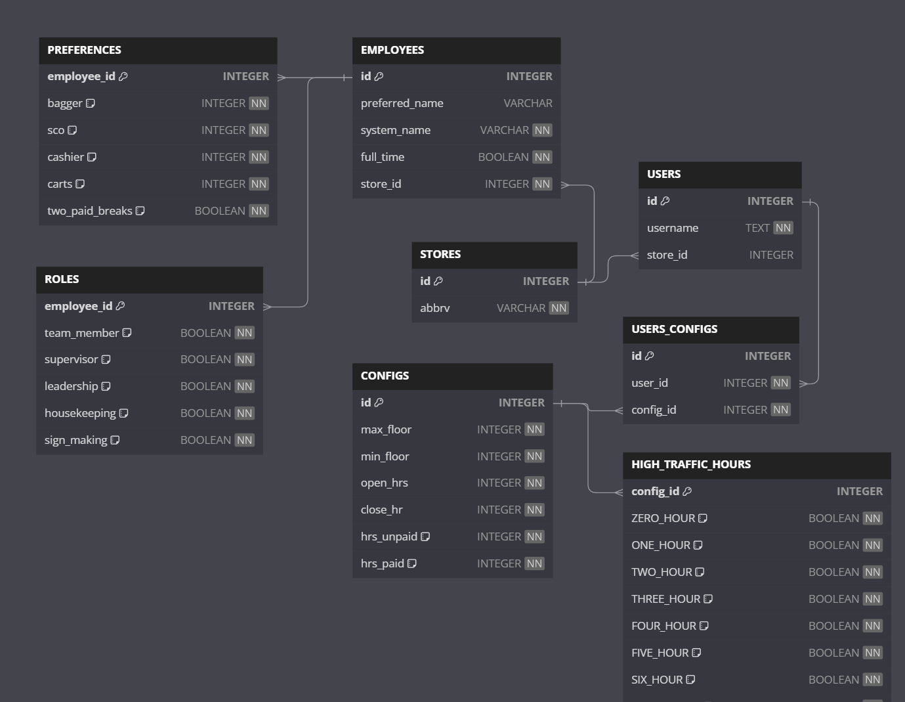

# Line Up Generator
## Problem Statement:  
Workers that are getting paid $19.50 - $27 (MA) an hour to make line up manually. Each line up takes 10-30 mins to complete. Without mentioning the cost of training these workers that would cost the company $4914 per year given that the highest paid supervisor took 30 minutes to create each lineup for the week.

State wide, it would cost $157,248 - given each location was had the same type of worker with the same wage - it would save wholefoods as a company 2.6 million a year of labor cost.

## Quick Start To Set Up Dev
```bash
cd wfm_scheduler

# install dependencies
pip install -r requirements.txt

# start python virtual env
.venv\Scripts\activate

# initiate the db
.\init_db.sh

# start dev server
.\dev.sh

# run tests
.\test.sh

```

## User Types

Team Members
- CA
- Cashier
- SCO Attendents

Leadership
- Booth
- Leadership
- Supervisors

Misc
- Housekeeping
- Sign Making


## Data Exploration

Input

|  |  |  |  | Paid | Meal | Paid | Meal | Paid | Shift | TM |  |  |  |
|---|---|---|---|:---:|:---:|:---:|:---:|:---:|:---:|:---:|---|---|---|
| Job | Reg # | TM Name | Shift | Break | Break | Break | Break | Break | Label | Initial | Notes |  |  |

Output

| Customer Service |  |  |  | Paid | Meal | Paid | Shift |
|---|---|---|---|:---:|:---:|:---:|:---:|
| Job | Reg # | TM Name | Shift  | Break | Break | Break | End |

## Features

Input:   
- Break Rules for TMs  
    - Based on break state accordance  
    - Not having people leaving the floor for more than 2 or max three if possible (unless leaving)
- Ordered Preferences
- Full Time Priority
- Input excel sheet  
 
Features
- Create Worker Preference
- Create break
- Create break cards
- Create SCO and Cart Hours
- Format excel doc visually
- If unable to fill: have a symbol for that hour

Misc
- auth0

Output 
- Excel sheet


## User flow
- Sign up if not user 
- Log in with auth0
    - (generate jwt and store it in http only cookie)
    - (redis?)
- Select store
- Upload excel sheet data
    - (generates employees and preferences, roles)
    - (generates config based off default)
- Looks at the displayed lineup that is fully formated
- User edits employees preferences and perferred name
- User edits configuration of the line up
- See highlighted areas where script not able to meet configuration requirements
- Users have the ability to edit each break and tasks
- User can print out the line up and break cards 
- Sign out


## Database Schema

